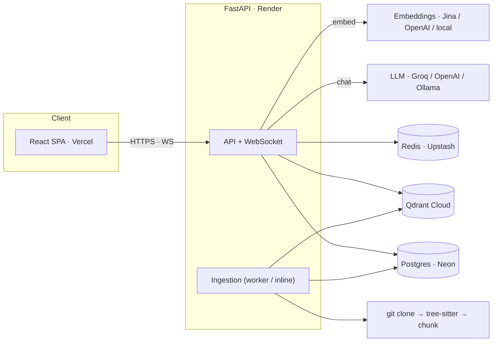
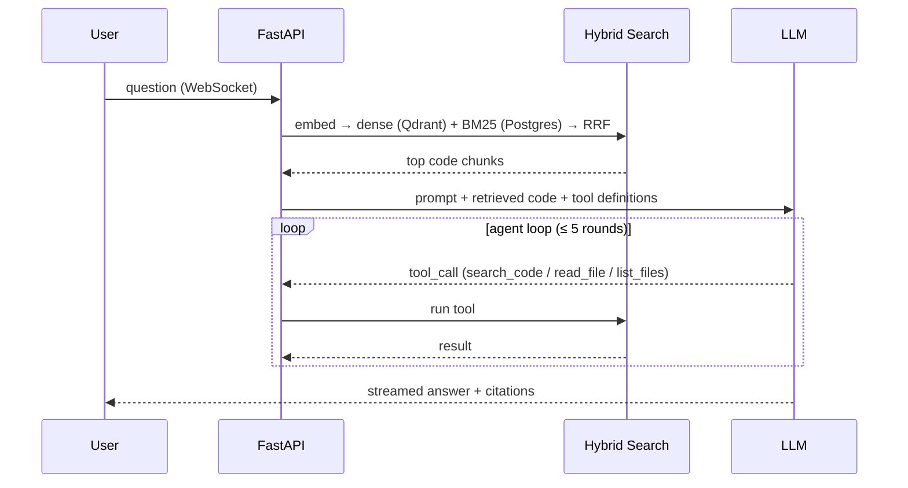
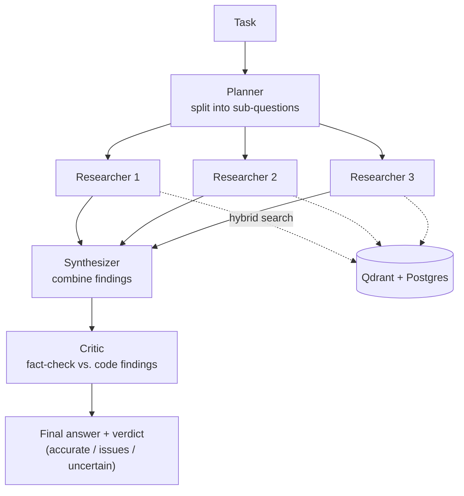

# AI Coding Agent Platform

An open, self-hostable AI coding platform — think Cursor / OpenHands / Continue.dev /
Devin, built as an extensible monorepo. Bring your own LLM (local **Ollama** or
**OpenAI**), point it at your repositories, and chat, search, review, and run code
against them.

> **Status:** Phases 1–9 of 10 complete. Phase 10 (enterprise: multi-tenant orgs,
> fine-grained RBAC, SSO/SCIM, billing, plugin marketplace) is planned.
> See [docs/PHASES.md](docs/PHASES.md) for the full roadmap.

## Live demo

- **App:** https://ai-coding-agent-project.vercel.app
- **API docs:** https://ai-coding-agent-api-djyt.onrender.com/docs

> Create an account to try it. The backend runs on a free tier and **sleeps after
> ~15 min idle**, so the first request can take 30–60s to wake. On the hosted
> deployment the sandbox is disabled (managed PaaS has no Docker socket) and
> chat/embeddings use hosted providers — details in [docs/DEPLOY.md](docs/DEPLOY.md).

## Architecture at a glance



A chat turn (RAG + agentic tool loop):



## Multi-agent pipeline

Beyond the single tool-using chat agent, the **Agents** page runs a multi-agent
pipeline over your code: a **planner** decomposes the task into sub-questions,
**researcher** agents answer each one grounded in retrieved code, a
**synthesizer** combines them, and a **critic** agent fact-checks the result
against the findings — returning a verdict (`accurate` / `issues` / `uncertain`)
with notes. Each stage is a guarded LLM call (a failure degrades to a partial
result, not a crash) and reuses the same hybrid retrieval + LLM-provider
abstraction as chat. See
[`app/domain/agents/service.py`](apps/api/app/domain/agents/service.py).



## Features

| Phase | Capability | Status |
|------:|------------|:------:|
| 1 | Monorepo foundations: FastAPI + React, JWT auth + RBAC, rate limits, Docker stack | ✅ |
| 2 | Repository ingestion: clone → tree-sitter parse → AST-aware chunk → embeddings → Qdrant, Celery workers, live SSE progress | ✅ |
| 3 | Hybrid search: Qdrant dense + Postgres BM25, Reciprocal Rank Fusion, cross-encoder reranker | ✅ |
| 4 | Chat / RAG: LLM provider abstraction (Ollama + OpenAI), WebSocket token streaming, conversation history | ✅ |
| 5 | Sandbox: hardened, disposable Docker containers (network-isolated, non-root, resource-capped) with a command-policy gate | ✅ |
| 6 | GitHub: PR generation and AI code review via PAT | ✅ |
| 7 | Memory: project / user memory store | ✅ |
| 8 | Observability: Prometheus metrics (incl. Celery multiprocess), cost accounting, Grafana dashboards | ✅ |
| 9 | Deployment: Helm chart with HPA / PDB / NetworkPolicy / Ingress | ✅ |
| 10 | Enterprise: orgs, fine-grained RBAC, SSO/SCIM, billing, marketplace | ⏳ planned |

## Quick start

### Windows (one-click)

A launcher is included that starts everything — the local LLM and the full stack:

```bat
Ai_coding_agent.bat        :: starts Ollama + all containers, opens the app
Ai_coding_agent_stop.bat   :: stops all containers + Ollama (frees CPU/RAM)
```

The launcher creates `.env` from `.env.example` on first run, starts the
[Ollama](https://ollama.com) server on the host, brings up the Docker stack, waits
for health, and opens the browser. Stop everything with the stop script when you're
done so nothing runs in the background.

### Any platform (Docker Compose)

Prereqs: Docker Desktop (or Docker + Compose v2). For local LLM chat, install and run
[Ollama](https://ollama.com) and pull a model (e.g. `ollama pull llama3.2`).

```bash
cp .env.example .env
docker compose up --build
```

Then open:
- Frontend → http://localhost:3000
- API docs → http://localhost:8000/docs
- Health   → http://localhost:8000/health
- Metrics  → http://localhost:8000/metrics
- Qdrant   → http://localhost:6333/dashboard
- Flower (Celery)  → http://localhost:5555
- Prometheus       → http://localhost:9090
- Grafana          → http://localhost:3001 (dashboard: *AI Coding Agent – Overview*)

Default seeded admin (created on first boot if `SEED_ADMIN=true`):
- email: `admin@local.test`
- password: `changeme123!`

Change the password immediately and disable the seed before exposing this anywhere.

## LLM providers

Chat and AI review need a model. Configure in `.env`:

- **Ollama (default, local)** — `LLM_PROVIDER=ollama`, `OLLAMA_DEFAULT_MODEL=llama3.2:latest`.
  The Ollama server runs on the host; containers reach it via
  `host.docker.internal:11434`. If chat fails with `ConnectError: All connection
  attempts failed`, the Ollama server isn't running — start it (`ollama serve`) or use
  the Windows launcher, which starts it for you.
- **OpenAI** — `LLM_PROVIDER=openai` and set `OPENAI_API_KEY`.

GitHub PR generation / review needs a `GITHUB_TOKEN` (PAT) in `.env`. The token is
server-side only and never sent to the frontend.

## Repository layout

```
apps/
  api/        FastAPI backend (Python 3.12, async SQLAlchemy, Alembic, Celery)
  web/        React + Vite + TypeScript frontend
infra/
  docker/     Init scripts, base images
  nginx/      Reverse proxy
  prometheus/ Prometheus scrape config
  grafana/    Grafana provisioning (datasources + dashboards)
  helm/       Helm chart (Phase 9)
docs/         ARCHITECTURE.md, PHASES.md, SECURITY.md, ADRs
scripts/      Dev/CI helpers
```

The Celery worker and sandbox run from the API image — there are no separate
`apps/worker` or `apps/sandbox` directories.

## Development

```bash
make dev        # docker compose up --build
make api-sh     # shell into the api container
make api-test   # run backend tests
make api-fmt    # ruff format + check
make api-mig msg="add foo"  # alembic revision --autogenerate
make api-upgrade            # alembic upgrade head
make web-dev    # run vite dev server outside docker
```

Without Make, the equivalent commands are in the [Makefile](./Makefile).

> Tip: after adding new frontend imports, Vite's dep cache can go stale. If a new page
> 404s or a module isn't found, clear it: remove `apps/web/node_modules/.vite` and
> `docker compose restart web`.

## Testing

- Backend: `pytest` with `pytest-asyncio`. Integration tests use `testcontainers`
  to spin up real Postgres + Redis. Run: `make api-test`.
- Frontend: `vitest` + React Testing Library. Run: `pnpm --filter web test`.

## Deploying

Docker Compose for local / single-node. For Kubernetes, use the Helm chart in
[infra/helm/aca](infra/helm/aca) (HPA, PDB, NetworkPolicy, Ingress; see its README).

## Security

See [docs/SECURITY.md](docs/SECURITY.md). Never commit `.env` — it is gitignored.
Secrets (`JWT_SECRET`, `GITHUB_TOKEN`, `OPENAI_API_KEY`) belong only in `.env` or your
deployment secret store.

## License

MIT (placeholder — choose your final license before publishing).
