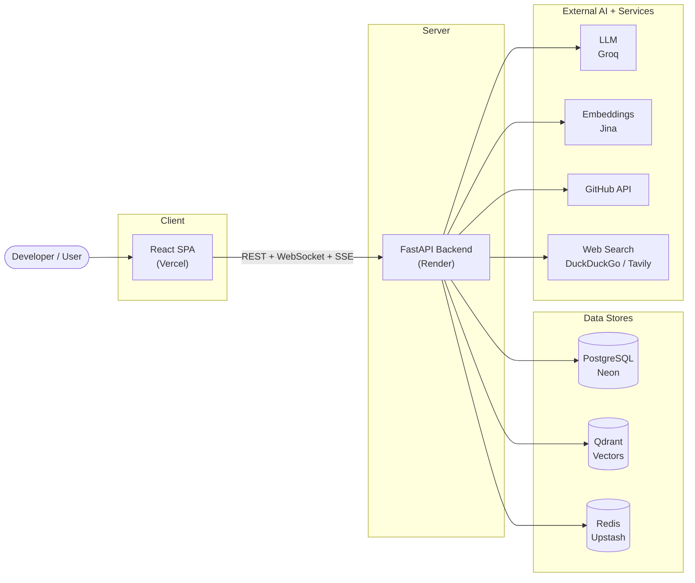
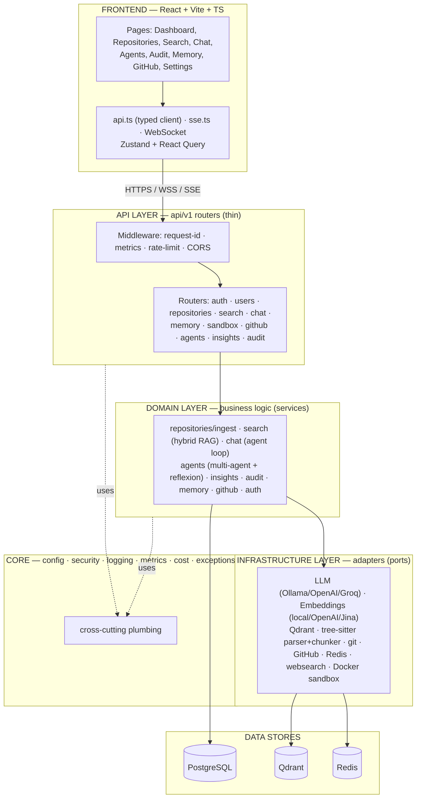
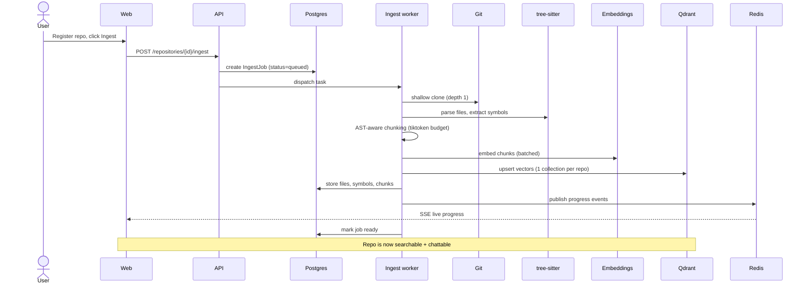
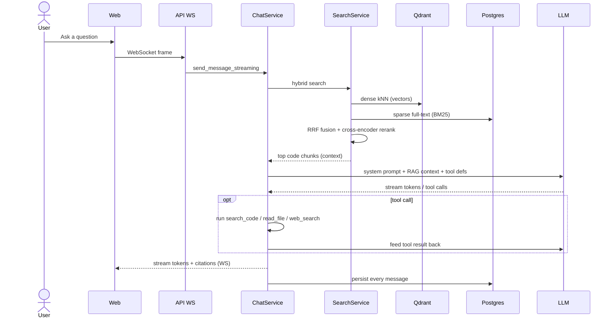
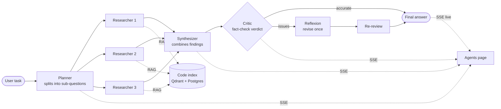
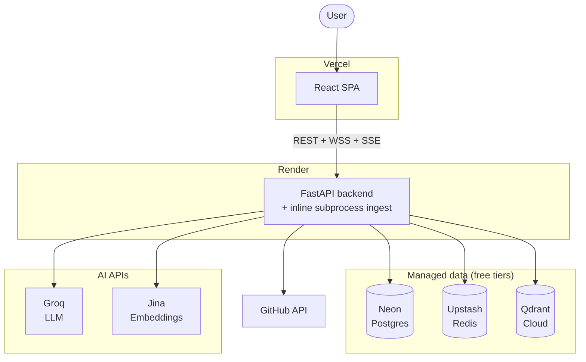

# AI Coding Agent — Architecture Diagrams (Interview Guide)

> A presentation-ready set of diagrams for explaining this project end-to-end.
> Every diagram below is **Mermaid** — it renders automatically on GitHub, in the
> VS Code *Markdown Preview* (with a Mermaid extension), and can be exported to a
> PNG/SVG slide at <https://mermaid.live> (paste the code between the ```` ```mermaid ````
> fences).

**How to present it (2-minute flow):** start with Diagram 1 (the one-slide big
picture), then drill into Diagram 2 (how the backend is layered), then show one
data flow that impresses — Diagram 4 (RAG chat) or Diagram 5 (multi-agent). Close
with Diagram 6 (deployment). Talking points are at the bottom.

---

## Diagram 1 — System context (the "one slide" view)

*Start here. Says what talks to what, at a glance.*



---

## Diagram 2 — Layered backend architecture (Clean Architecture + DDD)

*This is your "I understand software design" slide. Show the four layers and the
dependency direction: transport depends on domain, domain depends on
infrastructure — never the reverse.*



**The golden rule to say out loud:** *"models = DB shape, repository = the only
place that touches the DB, schemas = the API boundary (Pydantic), service =
orchestrates the use case. Infrastructure hides every external system behind a
Protocol, so I can swap Ollama for Groq or local embeddings for Jina with one env
var."*

---

## Diagram 3 — Ingestion pipeline (how code gets indexed)

*This is the richest flow — great to show you understand data pipelines.*



---

## Diagram 4 — RAG chat with tools (the core agent loop)

*Show this to prove you understand Retrieval-Augmented Generation + tool-using agents.*



**Key numbers to mention:** hybrid retrieval fuses dense + sparse with **RRF
(k=60)**, then a **cross-encoder rerank**; RAG context is capped (~1500 tokens);
the agent loop runs up to **5 rounds**, and tool calls are **de-duped and capped**
(2/round, 3/turn) so a runaway model can't blow the free-tier token budget.

---

## Diagram 5 — Multi-agent pipeline (planner → research → synthesize → critic → reflexion)

*This is your "agentic AI" showpiece.*



*The same building blocks power the **repo audit** (fan-out one reviewer per file →
severity-scored findings) and the **insights** generators (architecture diagram,
code map, onboarding docs, metrics, similar-code, test-gen).*

---

## Diagram 6 — Deployment topology (free-tier managed split)

*Close with this — shows you can ship, not just code.*



**Trade-off to mention:** on the free managed tier there's **no Celery worker**
(ingestion runs as an inline subprocess) and **no Docker sandbox** (managed PaaS
has no host Docker socket), so that feature is hidden behind a build flag. The same
code also runs full-fat via **Docker Compose** (9 services) locally or a **Helm
chart** on Kubernetes.

---

## Step-by-step: how it was built (the narrative)

Walk the interviewer through it as an evolution, phase by phase:

1. **Foundations** — a monorepo (`apps/api` + `apps/web`), FastAPI + React, JWT
   auth with refresh-token rotation + RBAC, rate limiting, structured logging.
2. **Ingestion** — clone a repo → detect language → **tree-sitter** parse → **AST-aware
   chunking** → embed → store vectors in **Qdrant**, with live **SSE** progress.
3. **Hybrid search** — dense (Qdrant) + sparse (Postgres BM25) fused with **RRF**,
   optional **cross-encoder rerank** — the retrieval backbone for everything.
4. **RAG chat** — a streaming, tool-using agent (WebSocket) grounded in retrieved
   code, with citations and durable **memory**.
5. **Sandbox** — hardened, disposable Docker containers behind a command-safety policy.
6. **GitHub** — generate PRs from changes and AI-review a PR's diff.
7. **Memory** — durable user/project facts recalled by vector search.
8. **Observability** — Prometheus metrics + token/cost accounting + Grafana.
9. **Deployment** — Helm chart (HPA/PDB/NetworkPolicy) and the free-tier cloud split.
10. **Agentic layer (added on top)** — the **multi-agent pipeline** (planner →
    researchers → synthesizer → **critic** → **Reflexion**), the **repo audit**, the
    **insights** generators, and the **web-search** tool — all reusing the same
    retrieval + LLM abstractions.

---

## Interview talking points (why each choice)

| Topic | What to say |
|-------|-------------|
| **Architecture style** | Clean Architecture + DDD; hexagonal ports/adapters. Strict dependency direction; every external system is behind a Protocol → swappable + testable. |
| **RAG quality** | Not just vector search — **hybrid** (dense + sparse), **RRF** fusion, **cross-encoder rerank**, and **AST-aware chunking** so chunks are semantically whole functions/classes. |
| **Agentic AI** | Two levels: a single tool-using ReAct-style chat agent, and a **multi-agent** planner/researcher/synthesizer/critic pipeline with a **Reflexion** self-correction loop. This is genuine "AI agents," not just prompt calls. |
| **Streaming** | **WebSocket** for token-by-token chat; **SSE** for long-running fan-outs (ingest, multi-agent, audit). |
| **Pluggability** | LLM and embeddings are Protocols — Ollama ↔ OpenAI ↔ Groq, local ↔ Jina — one env var. |
| **Production concerns** | Rate limiting (fails open), request-id correlation, Prometheus metrics + **cost accounting**, Argon2 + JWT rotation, a locked-down sandbox. |
| **Shipping** | Runs three ways (Docker Compose, Helm/K8s, free-tier managed split) with graceful degradation (inline ingestion when there's no worker; token-budget caps for free-tier LLMs). |
| **Resilience** | Tool-call caps, `tool_use_failed` retry-without-tools, and friendly rate-limit handling so one bad turn never crashes the chat. |

> **One-liner to open with:** *"It's a self-hostable AI coding platform: you point
> it at your git repos, it indexes them with tree-sitter + embeddings, and then you
> can search, chat (RAG + tools), run a multi-agent research pipeline, audit the
> code, and open PRs — all behind a clean layered backend with pluggable LLMs."*
```
